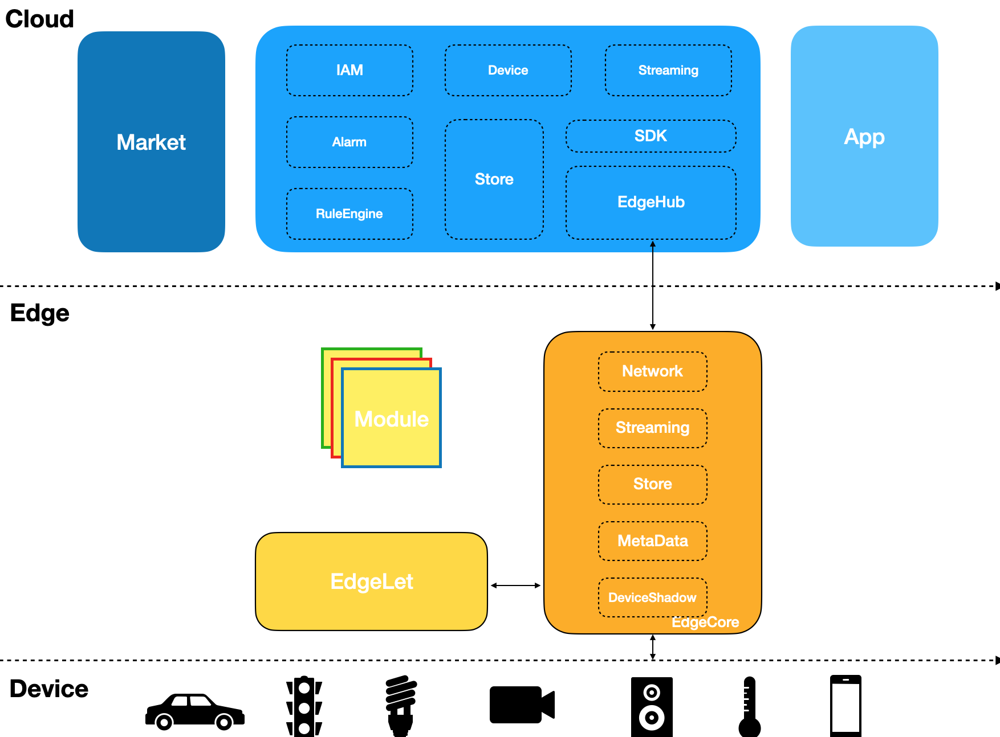

[](https://github.com/egccri/egccri/issues)

[](https://github.com/egccri/egccri/blob/main/LICENSE)

# Egccri

> Lightweight edge connect and compute runtime for various edge device.

### Architecture



### QuickStart

```shell
cargo run --bin egccri-hub
cargo run --bin egccri-connect
```
