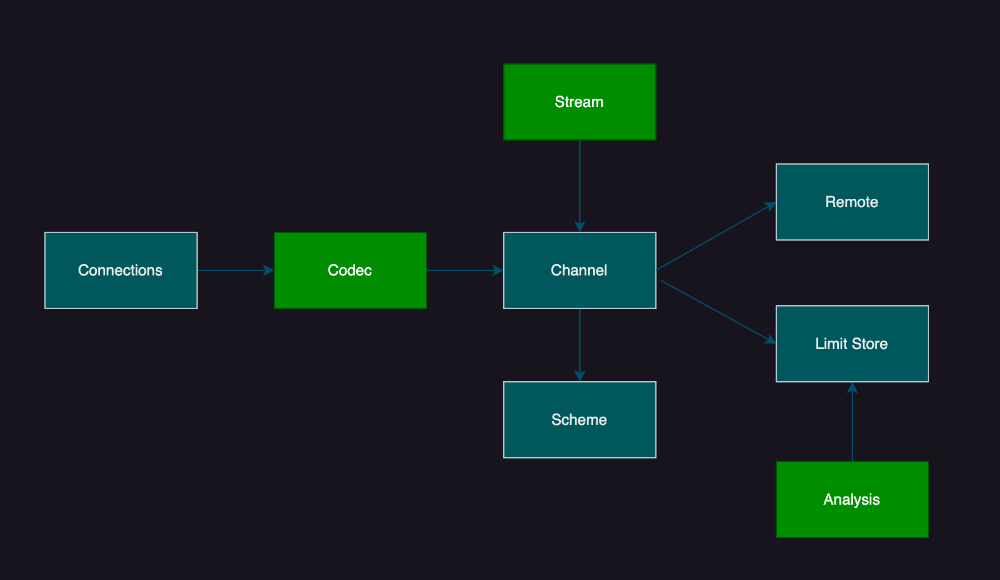

# Egccri

> Lightweight edge connect and compute for various edge devices.

### Features

+ Connect: device-edge side, any protocol like tcp, mqtt, ble, modbus; edge-cloud, edge-edge side, 5g closely.
+ Compute: low latency stream and fast analysis.
+ Security: raw data compute at the edge, use wasm for strong isolation.
+ Easy: easy to develop your app or business, just link the functions(wasm components).

### Architecture



### QuickStart

```shell
cargo run --bin egccri-hub
cargo run --bin egccri-connect
```
