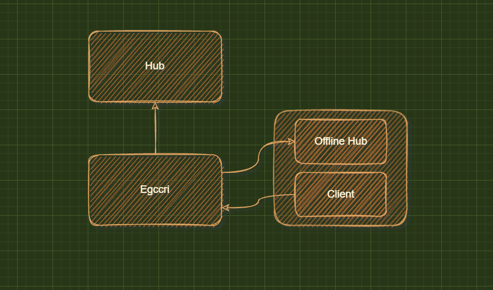

# Client model and communication design

### Date: 2022-12-06

## Status

Pre commit

## Context

We need a lightweight egccri and offline power.

## Decision

+ Egccri as a grpc client communication with Hub and Client Offline hub.
+ Egccri as an ipc server to recv client command that se/de with `bincode`.
+ Client as an ipc client to send client command.
+ Client as an inner client to control Offline Hub data.
+ Hub as a grpc server to store device data and metadata.
+ Offline hub as a grpc server to store device data and metadata.

## Consequences

