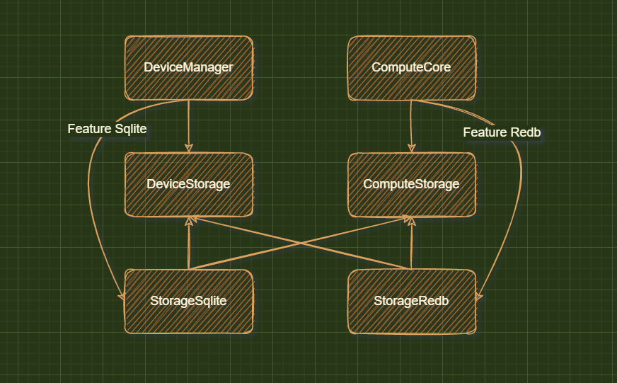

# storage module design

### Date: 2022-11-04

## Status

Pre commit

## Context

我们需要一个存储Egccri上下文，设备模型、设备影子、应用模块等信息的存储模块；

现阶段可能还会将传感器上传的度量数据存储在storage中；

storage模块同时为多个module提供服务，我们要考虑他的并发原理以及软件接口；

要考虑替换storage的技术选型，例如将现有的`sqlite`替换为`redb`；

我们要考虑将内嵌的数据库在分布式版本里替换为独立的数据库服务；

考虑存储模块单独线程下会遇到的问题，例如通信方式，错误处理，事务等；

考虑过后数据库模型版本升级，可以从命令行单独升级。

考虑兼容分布式版本和单体版本，考虑kv和rdms兼容。

## Decision

将连接和存储分开；将存储接口和存储实现分开；使用独立的线程初始化，让存储独立；

storage module initial -> modules -> module storage interface -> storage impl(new thread)

storage模块初始化：
    1. init conn poll
    2. create table

storage 依赖反转 实现方式：策略模式 + 组合模式

storage 分为两部分，策略模板部分和存储接口实现部分

## Consequences

